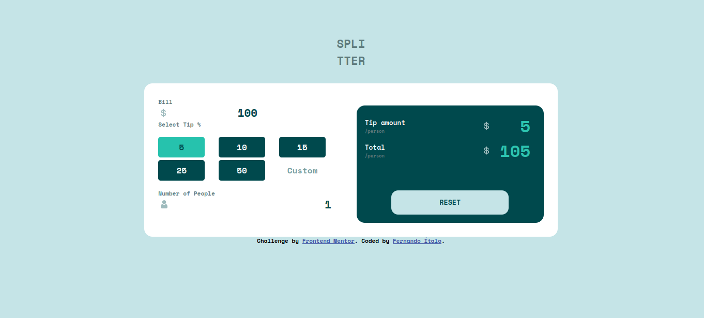

# Frontend Mentor - Tip calculator app solution

This is a solution to the [Tip calculator app challenge on Frontend Mentor](https://www.frontendmentor.io/challenges/tip-calculator-app-ugJNGbJUX). Frontend Mentor challenges help you improve your coding skills by building realistic projects.

## Table of contents

- [Overview](#overview)
  - [Screenshot](#screenshot)
  - [Links](#links)
  - [Built with](#built-with)
- [Author](#author)

## Overview

### Screenshot

### Built with

- Semantic HTML5 markup
- Flexbox
- CSS Grid

## Author

- Website - [Fernando Ítalo](https://fernandoitalodev.github.io/personal-portifolio/)
- Frontend Mentor - [@Mrprince039](https://www.frontendmentor.io/profile/Mrprince039)

